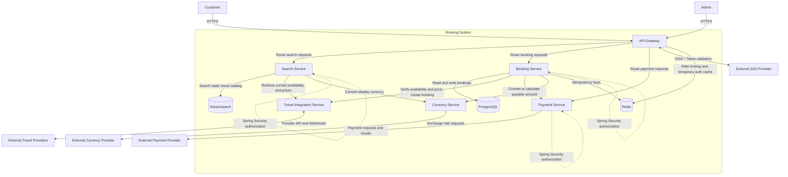

```mermaid
flowchart TB
    Customer[Customer]
    Admin[Admin]

    subgraph BookingSystem["Booking System"]
        Gateway[API Gateway]

        Search[Search Service]
        Booking[Booking Service]
        TravelIntegration[Travel Integration Service]
        Payment[Payment Service]
        Currency[Currency Service]

        Elasticsearch[(Elasticsearch)]
        PostgreSQL[(PostgreSQL)]
        Redis[(Redis)]
    end

    SSO[External SSO Provider]
    TravelProvider[External Travel Providers]
    PaymentProvider[External Payment Provider]
    CurrencyProvider[External Currency Provider]

    Customer -->|HTTPS| Gateway
    Admin -->|HTTPS| Gateway

    Gateway -->|Route search requests| Search
    Gateway -->|Route booking requests| Booking
    Gateway -->|Route payment requests| Payment

    Gateway <-->|OIDC / Token validation| SSO

    Search -->|Search static travel catalog| Elasticsearch
    Search -->|Retrieve current availability and prices| TravelIntegration
    Search -->|Convert display currency| Currency

    Booking -->|Read and write bookings| PostgreSQL
    Booking -->|Verify availability and price; create booking| TravelIntegration
    Booking -->|Initiate payment| Payment
    Booking -->|Convert or calculate payable amount| Currency
    Booking -->|Idempotency keys| Redis

    TravelIntegration <-->|Provider API and Webhooks| TravelProvider

    Payment -->|Payment requests and results| PaymentProvider

    Currency -->|Exchange rate requests| CurrencyProvider

    Gateway -->|Rate limiting and temporary auth cache| Redis

    Search -.->|Spring Security authorization| Search
    Booking -.->|Spring Security authorization| Booking
    Payment -.->|Spring Security authorization| Payment

```
