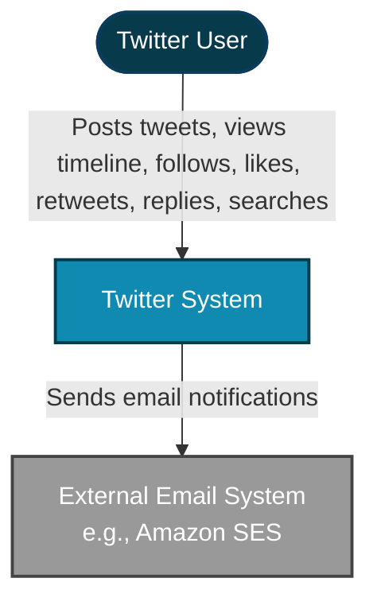
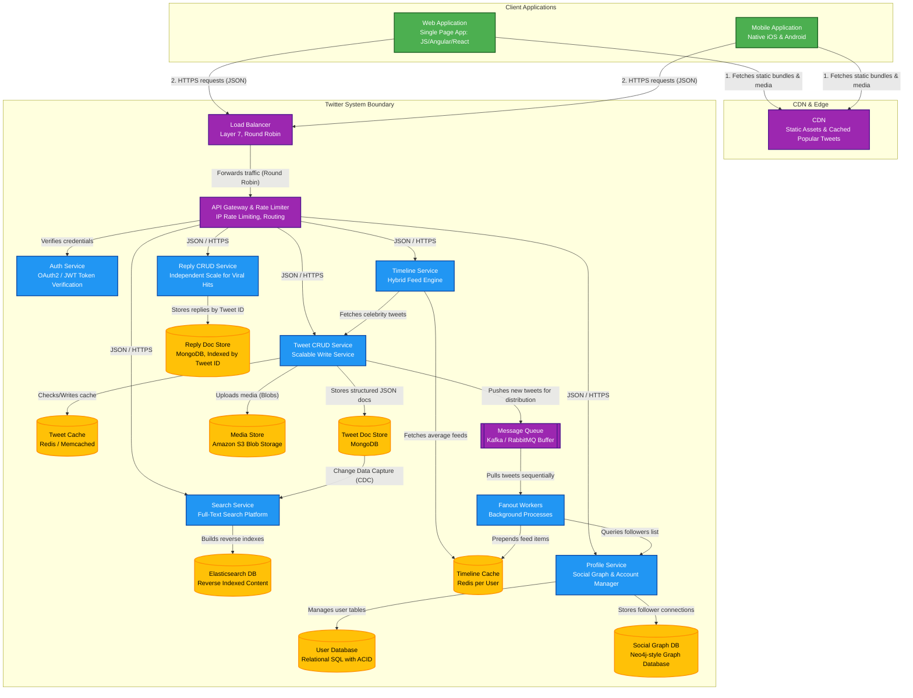
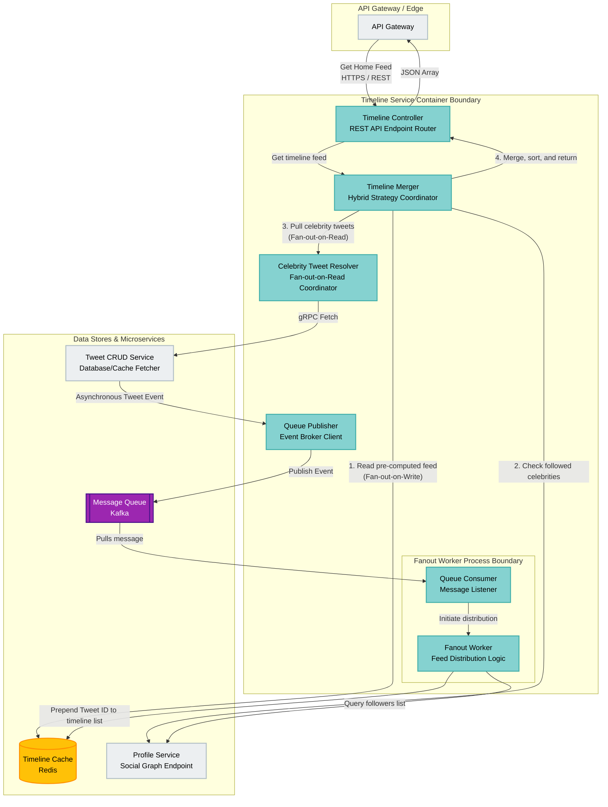

# Twitter (Micro-blogging Service) System Architecture: C4 Model Design

This document provides a comprehensive, production-grade architecture design for a Twitter-like micro-blogging service [1], structured according to the **C4 Model** (Context, Containers, and Components) [28]. The design is strictly grounded in established software engineering best practices [59] and system design strategies for high-throughput, low-latency social networks [3].

---

## Architecture Design Principles & Notation Strategy
In accordance with C4 model principles established by Simon Brown:
* **Abstractions First, Notation Second:** The system is structured into hierarchical levels of detail [60]. Shapes and colors complement a design that makes sense even in plain text [74].
* **Strict Communication Notation:** Every line features a unidirectional arrow representing a clear dependency or data flow [70]. Avoid generic "uses" descriptions; instead, the intent, protocol, and technology are explicitly labeled on every relationship [70, 71, 72].
* **Process Boundary Clarity:** Containers are modeled strictly as separate, deployable process boundaries [33]. Java and MySQL, or MongoDB and its application service, never run in the same process boundary and are shown separately [34].
* **Avoid Gateway Clutter:** The API Gateway is modeled as a container showing routing, rate limiting, and centralized auth, avoiding general-purpose diagram clutter by focusing strictly on architectural dependencies [7, 35].

---

## 1. Level 1: System Context Diagram
The System Context diagram establishes the boundaries of our Twitter software system, demonstrating how users interact with it and how it integrates with external infrastructures.

### Element Catalog
| Element | Type | Description |
| :--- | :--- | :--- |
| **Twitter User** | Persona | A personal user who wants to post micro-messages, follow other users, interact with content, and read their personalized timeline [2, 3]. |
| **Twitter System** | Software System | The core micro-blogging application providing low-latency, highly available content creation, feeds, and social graphs [3, 4]. |
| **External Email System (Amazon SES)** | External System | An external email delivery system utilized for user registration, alerts, and transactional messages [27, 31, 36]. |

---

## 2. Level 2: Container Diagram
The Container diagram illustrates the high-level technical architecture of the Twitter application, focusing on deployable process boundaries, data stores, caches, and networking [31, 33].

### Container Directory & Technical Mapping
| Container | Process Boundary Type | Technology | Protocol / Port | Architectural Rationale & Design details |
| :--- | :--- | :--- | :--- | :--- |
| **Web & Mobile Apps** | Client Runtime | React / Angular (Web) [65], Swift / Kotlin (Mobile) [5] | HTTPS (Port 443) | Frontend UI allowing users to interact with tweets, view feeds, and manage follow connections [2, 3]. |
| **CDN** | Distributed Edge Network | Cloudflare / Akamai | HTTPS (Port 443) | Drastically reduces read latency globally by serving static media files and highly requested popular tweets directly from edge servers [12]. |
| **Load Balancer** | Edge Routing Service | NGINX / AWS ALB | Layer 7 [6], HTTPS | Uses a Round Robin routing algorithm [6] to fairly distribute requests across the stateless API Gateway fleet [6, 7]. |
| **API Gateway & Rate Limiter** | Gateway Reverse Proxy | Kong / Spring Cloud Gateway | HTTPS | central entry point that handles IP-based rate limiting [22] (preventing bot traffic and DDOS) and content-based routing [6, 7, 22]. |
| **Auth Service** | JVM Process | Spring Boot / OAuth2 | gRPC / Internal Port | Isolates core authentication and token validation from the profile logic to ensure high security and easy maintenance [20, 21]. |
| **Tweet CRUD Service** | Go / JVM Process | Golang or Spring Boot | gRPC / REST | High-throughput stateless microservice [7] responsible for creating, editing, and deleting tweets, as well as handling retweets and likes [8, 9]. |
| **Tweet Document Store** | Database Process | MongoDB | Port 27017 | Schema-less NoSQL database [9] storing tweets as structured JSON documents [10]. Excellent for rapid read/write operations and requires no complex joins [9, 10]. |
| **Media Store** | Cloud Storage | Amazon S3 | HTTPS (API) | Highly scalable blob storage ideal for hosting raw media assets (photos and videos) referenced inside tweet documents [10]. |
| **Tweet Cache** | Caching Cluster | Redis / Memcached | Port 6379 | Caches popular tweets [12] on the read path to prevent DB bottlenecking and achieve sub-millisecond retrieval speeds [12]. |
| **Reply CRUD Service** | Node.js / Go Process | Node.js | gRPC / REST | Separating replies from tweets guarantees that massive reply volumes for viral tweets can scale independently without affecting primary tweet pipelines [13]. |
| **Reply Document Store** | Database Process | MongoDB | Port 27017 | Relies on a separate schema [13] indexed heavily on `tweet_id` to quickly pull sub-threads of comments on demand when a user expands a tweet [14]. |
| **Search Service** | Java Process | Elasticsearch Node | gRPC / REST | Indexes tweet text, hashtags, and usernames [15]. |
| **Elasticsearch DB** | Search Index Store | Elasticsearch | Port 9200 | Utilizes reverse indexing [15] for low-latency full-text search [16]. Receives records asynchronously from MongoDB using Change Data Capture (CDC) to keep indices fresh without blocking writes [16]. |
| **Timeline Service** | JVM Process | Java Spring Boot | gRPC / REST | Implements a hybrid timeline model [19] optimizing read speed (low latency) and write distribution [3, 18]. |
| **Message Queue** | Messaging Bus | Apache Kafka [17] | TCP / Port 9092 | Acts as a write-buffer [17] for newly created tweets, ensuring that massive spikes in write traffic do not overload downstream fan-out systems [17]. |
| **Fanout Workers** | Go Process Fleet | Golang | Go Routine Pool | Background workers that pull events from the queue [18], query the follower network [18], and write updates to user feeds [18]. |
| **Timeline Cache**| Cache Cluster | Redis | Port 6379 | Quick access store hosting pre-computed feeds for average active users [18]. |
| **Profile Service** | JVM Process | Java Spring Boot | gRPC / REST | Manages basic user metadata, profiles, and follower/social connections [8, 19, 20]. |
| **User Database** | RDBMS Cluster | PostgreSQL / MySQL [19] | Port 5432 | Relational SQL database [19] representing structured user accounts. Chosen to enforce data integrity and strict schema validations using ACID compliance [20]. |
| **Social Graph DB** | Graph Database | Neo4j style database | Port 7687 | Specialized database optimized for executing deep, complex traversal queries over social relationships (follows/followers) [20]. |

---

## 3. Level 3: Component Diagram (Timeline & Fan-out Engine)
The core engine of Twitter's design is the **Timeline Service & Fan-out Distribution Engine** [16]. This component-level diagram illustrates how requests and asynchronous pipelines interact inside the Timeline Service container boundary.

### Component Catalog
| Component | Type | Responsibility & Data Flow |
| :--- | :--- | :--- |
| **Timeline Controller** | REST Controller | Handles incoming HTTPS requests from the API Gateway [7] demanding a user's home timeline feed, extracting metadata like pagination and user ID. |
| **Timeline Merger** | Core Business Logic | Orchestrates the hybrid timeline creation [19]. It retrieves pre-computed feeds from the Timeline Cache [18], queries the user's social graph to find followed mega-influencers [18, 19], dynamically pulls celebrity posts [19], and merges/sorts them in memory with low latency [3]. |
| **Celebrity Tweet Resolver** | Client Gateway | Communicates via gRPC with the Tweet CRUD Service to fetch the most recent tweets of high-profile (mega-influencer) accounts that are followed by the requesting user [19]. This implements the *Fan-out on Read* branch of the hybrid timeline [19]. |
| **Queue Publisher** | Event Producer | Runs inside the write pipeline. When a new tweet is successfully persisted, it publishes a serialization of the tweet (metadata, author ID) onto the Kafka cluster [17, 18]. |
| **Queue Consumer**| Event Listener | Runs inside the background worker daemon [18]. It polls Kafka topics for newly published tweets to initiate distribution [18]. |
| **Fanout Worker** | Service Worker | Implements the *Fan-out on Write* process [18]. For every tweet consumed: 1) Queries the Profile Service to obtain the author's follower list [18]; 2) Triggers parallel batch writes to prepending the tweet ID directly into each follower's pre-computed timeline in Redis [18]. |

---

## 4. Cross-Cutting Design Considerations & Security
To ensure compliance with non-functional requirements (high availability, scale, latency, security) [3], several critical cross-cutting architectures are embedded [21]:

### Hybrid Timeline Trade-off Matrix [17, 18, 19]
To scale to millions of DAUs, a single distribution path is mathematically insufficient [3]:
* **Fan-out on Write (Push Model):**
  * *Mechanism:* When a tweet is created, background workers write to all followers' caches [18].
  * *Pros:* Feeds load instantly (low-latency reads) [18].
  * *Cons:* Destructive write-amplification for high-profile accounts (e.g., a celebrity with 80M followers requires 80M writes instantly, overloading the DB/caches) [19].
* **Fan-out on Read (Pull Model):**
  * *Mechanism:* At read time, the feed engine fetches tweets from followed celebrities and merges them [19].
  * *Pros:* No write overload when a celebrity posts [19].
  * *Cons:* More complex read logic and increased query-time computation [17].
* **Our Hybrid Implementation:** Celebrities (threshold set dynamically, e.g., >25,000 followers) are excluded from the *Fan-out on Write* queue [19]. Their posts are merged dynamically at feed retrieval time [19].

### Security Architecture [21, 22]
* **Auth Verification:** Every request passing the Load Balancer has its JWT validated by the Auth Service at the API Gateway level [21, 22].
* **IP Rate Limiting:** Implemented inside the API Gateway reverse-proxy layers to actively block denial-of-service attempts and malicious bot scraping [11, 22].
* **Data Transit Encryption:** Enforcement of HTTPS (TLS 1.3) across the client-to-gateway lifecycle [21].
* **Input Validation:** Crucial for preventing Cross-Site Scripting (XSS) and SQL Injection (SQLi); input sanitization happens both on the clients and as a primary middleware inside all REST API gateway controllers [22].

### Observability & Infrastructure Monitoring [23]
* **Distributed Logging:** Every microservice outputs structured logs to an asynchronous Logstash forwarder, routing to a centralized Elasticsearch index, visualizable on Kibana dashboard metrics (**ELK Stack**) [23].
* **Real-time Alerting:** Prometheus continuously collects system metrics (CPU, RAM, API response latency, cache eviction rates), integrating with Alertmanager/PagerDuty to alert engineering teams of anomalies [23, 24].
