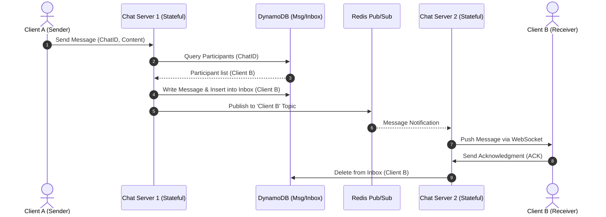
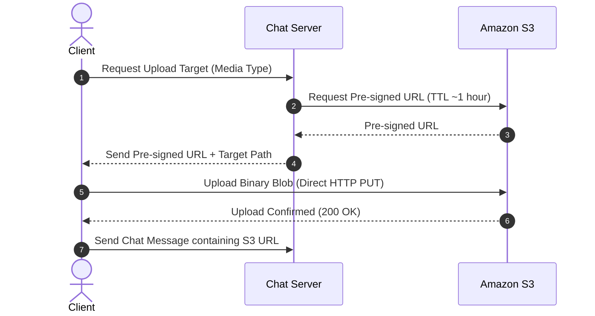

# WhatsApp System Design Specification

This document details the system design of a highly scalable, real-time messaging application similar to WhatsApp or Messenger. The architecture is designed to support billions of users, low latency message delivery (~500ms), multiple client devices, and strict data privacy requirements.

---

## 1. Requirements & System Constraints

### Functional Requirements
1. **Start Chats:** Users can start individual (1-to-1) or group chats (a 1-to-1 chat is modeled as a group chat with 2 participants).
2. **Send and Receive Messages:** Users can send and receive real-time text messages within active chats.
3. **Media Attachments:** Support sharing media attachments (images, audio, video) inside chats.
4. **Offline Access:** When a device goes offline and reconnects, it must receive all messages that were sent while it was offline.
5. **Multiple Devices:** A user can connect and synchronize messages across multiple devices (e.g., phone, laptop).
6. **Presence Indicators:** Show real-time online/offline status (green orbs) of contacts in the chat list.

### Non-Functional Requirements
1. **Low Latency:** End-to-end message delivery target of **under 500 milliseconds** for online recipients.
2. **Guaranteed Delivery:** Messages must eventually be delivered to all intended recipients.
3. **High Throughput:** The system must handle billions of active users and heavy message traffic.
4. **Data Minimization (Privacy):** Messages are considered "toxic sludge" (liability) and are deleted from the backend servers as soon as they are successfully delivered to all recipient devices, or after a maximum retention window of 30 days.
5. **Fault Tolerance:** Individual node or component failures should not cause system-wide outages.

---

## 2. Core Entities & Data Model

### Core Entities
* **User:** Peer-to-peer actors on the network (all users have equal footing).
* **Device / Client:** The physical hardware (e.g., phone, laptop) belonging to a User. Connectivity and message delivery are tracked at the device level, not just the user level.
* **Chat:** A conversation group containing 2 or more participants.
* **Message:** Individual content units sent by users within a chat.

### Database Schema (DynamoDB)
The system utilizes **DynamoDB** (or a similar highly-scalable key-value/NoSQL database) for storing structured metadata. 

#### Chat Table
Stores metadata for each conversation room.
* **Partition Key (PK):** `ChatID` (UUID)
* **Attributes:** `Name`, `CreatedAt`, `CreatedBy`, and other metadata.

#### Chat Participant Table
Tracks which participants are in which chats. This table must support two query patterns:
1. Finding all participants of a given chat ID (to route sent messages).
2. Finding all chats that a specific user is a participant of (to populate the chat list on startup).

* **Partition Key (PK):** `ChatID` (UUID)
* **Sort Key (SK):** `ParticipantID` (UUID)
* *Note:* A **Global Secondary Index (GSI)** is created with `ParticipantID` as the Partition Key to allow rapid lookups of all chats a user belongs to without performing full table scans.

#### Messages Table
Stores the permanent record of messages (until deleted by cleanup).
* **Partition Key (PK):** `MessageID` (UUID)
* **Attributes:** `ChatID`, `Contents` (text or media URL), `CreatorID`, `Timestamp`.

#### Inbox Table
Acts as a durable buffer for undelivered messages. Once a client receives a message and acknowledges (ACKs) it, the corresponding entry is deleted.
* **Partition Key (PK):** `RecipientClientID` (UUID) - Tracks delivery to specific devices.
* **Sort Key (SK):** `MessageID` (UUID)
* **Attributes:** `Timestamp`.

---

## 3. System Architecture

```mermaid
graph TD
    ClientA[Client A]
    ClientB[Client B]
    
    L4LB[L4 Load Balancer <br> Least Connections]
    
    CS1[Chat Server 1]
    CS2[Chat Server 2]
    
    Redis[Redis Pub/Sub Cluster]
    
    S3[S3 Blob Storage <br> Media Attachments]
    
    subgraph Database (DynamoDB)
        ChatTable[(Chat Table)]
        PartTable[(Chat Participant Table)]
        MsgTable[(Messages Table)]
        InboxTable[(Inbox Table)]
    end
    
    Cleanup[Cleanup Service]
    
    ClientA <-->|Websockets/TLS| L4LB
    ClientB <-->|Websockets/TLS| L4LB
    
    L4LB <--> CS1
    L4LB <--> CS2
    
    CS1 <-->|Pub/Sub| Redis
    CS2 <-->|Pub/Sub| Redis
    
    CS1 --->|Write Msg & Inbox| Database
    CS2 --->|Write Msg & Inbox| Database
    
    ClientA --->|Direct Upload/Download| S3
    ClientB --->|Direct Upload/Download| S3
    
    CS1 <--->|Pre-signed URLs| S3
    CS2 <--->|Pre-signed URLs| S3
    
    Cleanup --->|Delete messages > 30 days| Database
```

### Architectural Components

1. **Layer 4 Load Balancer (L4LB):**
   * Since WebSockets are stateful, connection-oriented protocols, traditional Layer 7 (HTTP) load balancers are less optimal. 
   * A Layer 4 load balancer operates at the TCP level, maintaining symmetric TCP connections between the client and the chat servers. 
   * It uses a **"least connections"** routing algorithm. When scaling out, new chat servers with zero connections will be saturated quickly, distributing connections evenly.

2. **Stateful Chat Servers:**
   * These servers manage persistent, long-lived WebSocket (or simple TLS) connections with clients. 
   * A single modern server can hold up to **2 million active connections**.
   * They maintain an in-memory hashmap mapping connected `ClientID`s to their corresponding local socket descriptors.

3. **Redis Pub/Sub Cluster:**
   * Resolves the routing problem where *Client A* is connected to *Chat Server 1* but wants to send a message to *Client B* who is connected to *Chat Server 2*.
   * Each chat server subscribes to Redis Pub/Sub topics corresponding to the `ClientID`s of its active local connections.
   * When a message needs to be routed to a client, the server publishes a notification to that client's Redis topic, which routes it to the correct chat server holding that active connection.
   * *At-most-once* delivery of Redis Pub/Sub is acceptable because the durable **Inbox Table** in DynamoDB guarantees final delivery.

4. **Blob Storage (Amazon S3):**
   * Large files (videos, images, audio) are never passed directly through the stateful chat servers or NoSQL tables. Doing so would exhaust server bandwidth and crash the NoSQL databases.
   * Instead, S3 is used for large blob storage.

5. **Cleanup Service:**
   * A background worker that runs periodically to enforce data minimization. It scans timestamps on the `Messages` and `Inbox` tables and purges any records older than 30 days.

---

## 4. Key Workflows & Data Flows

### A. Real-Time Messaging Flow (Online)
The sequence below illustrates how a message travels from Client A to Client B when both are online.



1. **Client A** sends a `sendMessage` command via its WebSocket connection to **Chat Server 1**.
2. **Chat Server 1** queries the `Chat Participant Table` in DynamoDB to identify all recipients.
3. A transactional write is executed in DynamoDB to:
   * Insert the message into the `Messages Table`.
   * Create an entry in the `Inbox Table` for **Client B** (to guarantee durability in case of disconnection mid-flight).
4. **Chat Server 1** publishes the message payload to the Redis Pub/Sub topic matching **Client B's** ID.
5. Redis routes the payload to **Chat Server 2** (which is subscribed to Client B's topic).
6. **Chat Server 2** pushes the message to **Client B** over its active WebSocket connection.
7. **Client B** receives the message and sends an acknowledgment (`ACK`) back to **Chat Server 2**.
8. **Chat Server 2** deletes Client B's message entry from the DynamoDB `Inbox Table`.

### B. Offline & Reconnection Flow
If Client B is offline when Client A sends the message:
1. Steps 1-3 of the Online Flow proceed as normal.
2. In Step 4, when Chat Server 1 publishes to Redis Pub/Sub, no server is actively subscribed to Client B's topic because Client B is offline. The message is dropped by Redis (at-most-once delivery).
3. The message remains safely stored in the durable **Inbox Table** in DynamoDB.
4. When **Client B** reconnects to any Chat Server:
   * The server queries the `Inbox Table` for `RecipientClientID = ClientB`.
   * The server fetches the corresponding message contents from the `Messages Table`.
   * The server sends the backlogged messages to Client B over the new WebSocket connection.
   * Client B ACKs each message, and the server removes them from the `Inbox Table`.

### C. Media Attachments (Pre-signed URLs)
To avoid overloading the stateful chat servers with massive binary uploads, the system uses pre-signed S3 URLs.



1. The sending **Client** requests an upload target from the **Chat Server** via WebSockets.
2. The **Chat Server** uses its backend AWS credentials to request a pre-signed URL from **S3** with a short Time-To-Live (TTL) of 1 hour.
3. The **Chat Server** returns the pre-signed URL to the **Client**.
4. The **Client** uploads the raw media binary directly to **S3** via a standard HTTP PUT request. This bypasses the Chat Server completely, preserving its CPU and bandwidth.
5. Once the upload finishes, the **Client** sends a normal text message to the chat containing the S3 URL of the uploaded asset.
6. The receiver fetches the asset directly from **S3** using the URL found in the text message.

---

## 5. Advanced Scaling & Extensions

### Multi-Device Support
To support multiple devices per user (e.g., active on phone and web simultaneously):
1. Expand the data model from being user-centric to **client/device-centric**.
2. Store a mapping of `UserID` -> list of active `ClientID`s.
3. When sending a message, query the user's active devices and insert a separate row into the `Inbox Table` for **each distinct device** (`RecipientClientID`).
4. Each device maintains its own WebSocket connection and independently ACKs received messages, clearing its own inbox records.
5. **Constraint Consideration:** Since DynamoDB transactions are limited to 100 write operations, the product must enforce strict limits:
   * Limit the number of active devices per user (e.g., max 3-5 devices).
   * Limit the maximum group chat size (e.g., max 100 participants to fit inside a single transaction, or implement chunked batched writes for larger groups).

### Presence Indicators (Online/Offline Status)
Presence tracking is implemented as a light-weight publish-subscribe layer on top of connection events:
1. When a client establishes a WebSocket connection, the Chat Server writes a status of `Online` to a global Redis or DynamoDB presence table with a short TTL.
2. While connected, the client sends periodic "heartbeats" to keep the TTL active.
3. When the connection is cleanly closed or times out, the status is set to `Offline`.
4. To view the status of friends:
   * **Polling approach:** On app startup, the client queries the status table for all contacts on its active chat list.
   * **Real-time updates:** Clients subscribe to the presence topics of their contacts. When a user's connection status changes, a notification is published via the Pub/Sub system and fanned out to all subscribed online peers.

---

## 6. Storage & Capacity Estimation

Assuming a system scale of **1 billion daily active users** with an average of **100 messages per user per day**:

* **Daily Message Volume:** 
  $$\text{1,000,000,000 users} \times \text{100 messages/user/day} = \text{100 billion messages/day}$$

* **Message Size:** 
  Assuming an average message size of **1 Kilobyte (KB)** (accounting for text contents, timestamps, and metadata).

* **Daily Data Volume:** 
  $$\text{100 billion messages} \times \text{1 KB} = \text{100 trillion bytes} = \mathbf{100\text{ Terabytes (TB) per day}}$$

* **Data Retention & Storage Cost:**
  * While 100 TB is generated daily, the vast majority of messages are delivered immediately and deleted from the database in real-time.
  * Only undelivered messages (offline users) and messages awaiting the 30-day retention cleanup window are retained.
  * Therefore, the active database footprint is easily kept on the order of a few hundred Terabytes (TB) rather than Petabytes, making it highly cost-effective and highly performant.
